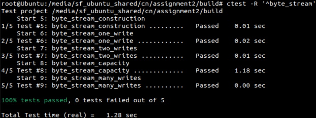
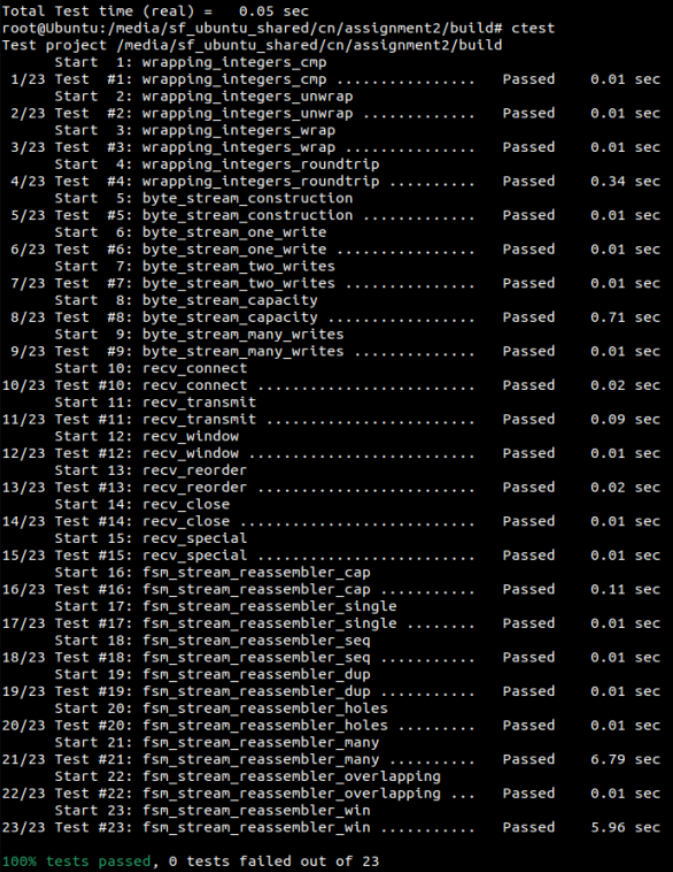

## ByteStream 
A ByteStream is a container that stores a collection of bytes from which bytes can be read or written to. These are some of the properties of this byte stream implementation:
- Bytes are written on the input side and read out from the output side.
- The byte stream is finite. The writer can end the input and no more bytes can be written.
- When the reader has read to the end of the stream, it will reach EOF, that is no more available bytes to read
- It is initialized with a particular capacity which limits the total amount of bytes that can be held in memory at once (which are not read yet).
- The writer would not be allowed to write into the byte stream if it exceeds the storage capacity.
- As the reader reads bytes from the stream, the writer is allowed to write more.
> Note: This ByteStream implementation should be used in a single threaded context; as locking or race conditions are not handled. 

The interface for the ByteStream is available here [byte_stream.hh](./src/byte_stream.hh) and the implementation is available here [byte_stream.cc](./src/byte_stream.cc)

### Tests
Run `make` inside the build directory to build the project and `ctest -R '^byte_stream'`, to run all the tests associated with byte_stream.

## Reassembler
Reassembler is responsible for reassembling the string of bytes obtained from the sender and storing it in the ByteStream. The TCP sender is dividing its byte stream up into short segments (substrings not more than 1460 bytes apiece) so that they can fit inside a datagram. In reality, the network might reorder these datagrams, drop them or deliver them more than once. 

It is the job of the receiver to reassemble the segments into a contiguous stream of bytes that the sender originally intended. This is where reassembler comes into play. The Reassembler receives substrings from the sender which consists of a string of bytes along with an index of the first byte of the string that represents its position within the larger stream. As a simple example, let's say the sender wants to send “abcdefgh” to the receiver and assume that the sender has divided the entire payload into two substrings “abcd” and “efgh”. 

Now the indexes for these substream will be the following:
1. [0] : abcd
2. [4] : efgh

Now on the receiver end lets say the the datagrams are received in following order (efgh,4) -> (abcd,0). The Reassembler using these unique indexes will paste the substrings into the byte stream in the correct order (abcdefgh).

The interface for the Reassembler is available here [stream_reassembler.hh](./src/stream_reassembler.hh) and the implementation is available here [stream_reassembler.cc](./src/stream_reassembler.cc)

### Tests

## TCP receiver
TCP receiver accepts a TCPSegment from the sender and utilizes the Reassembler to correctly write the bytes into the byte stream. One thing to note is that apart from accepting the bytes, the TCPReciever also needs to generate messages back to the sender. These “receiver messages” are responsible for telling the sender:
- Index of “first unassembled” byte called acknowledgement number or ackno.
- The available capacity in the output ByteStream. This is called the “window size”. Together the ackno and window size describe the receiver's window: a range of indexes that the TCP sender is allowed to send. Using the window, the receiver can control the flow of incoming data, making the sender limit how much it sends until the receiver is ready for more.

The interface for the TCPReceiver is available here [tcp_receiver.hh](./src/tcp_receiver.hh) and the implementation is available here [tcp_receiver.cc](./src/tcp_receiver.cc)

### Tests

